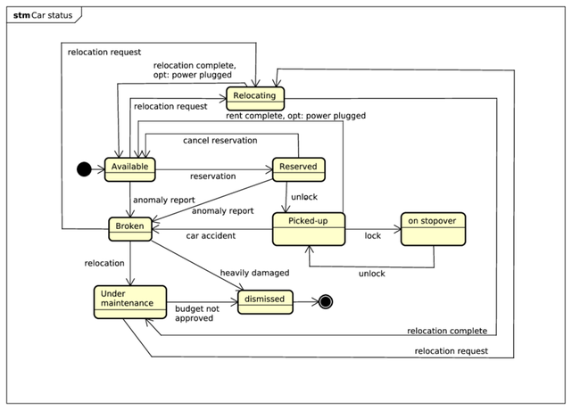

#HSLIDE


#HSLIDE
# PowerEnJoy
  - Erba Alessandro
  - Leveni Filippo
  - Lodi Luca

#HSLIDE
## A new car sharing
#VSLIDE


#VSLIDE
### Electric cars


#VSLIDE
### Incentives eco-friendly behaviors


#VSLIDE
### Higher probability of finding cars


#HSLIDE
# Goals

#VSLIDE
### Business driver related goals
<li> **G.1** user's simple access to the PowerEnjoy services</li><!-- .element: class="fragment" -->
<li> **G.2** higher probability of finding a car, compared to competitors</li> <!-- .element: class="fragment" -->
<li> **G.3** efficient maintenance and recharge process of the cars</li> <!-- .element: class="fragment" -->

#VSLIDE
### Car sharing related goals
<li> **G.4** car reservation, reservation cancellation</li> <!-- .element: class="fragment" -->
<li> **G.5** minimum interaction with payment interfaces </li><!-- .element: class="fragment" -->
<li> **G.6** drive cars, find safe areas where to park </li><!-- .element: class="fragment" -->
<li> **G.7** To encourage users’ virtuous behaviour in relation to service’s fairness. </li><!-- .element: class="fragment" -->

#VSLIDE
### Process efficiency related goals
<li> **G.8** system monitorable / administrable by authorized personal </li><!-- .element: class="fragment" -->
<li> **G.9** authorized personal quickly react to emergencies, user’s safety </li><!-- .element: class="fragment" -->
<li> **G.10** programmable interface, reduce maintainance costs, third party developers. </li><!-- .element: class="fragment" -->

#HSLIDE
## Class diagram

#VSLIDE?image=presentation/class_diag.pdf.png

#VSLIDE


#VSLIDE


#VSLIDE


#HSLIDE
# Actors
#HSLIDE
### PowerEnJoy user


#HSLIDE
## User
### interfaces
#VSLIDE

#VSLIDE

#VSLIDE

#VSLIDE

#VSLIDE


#HSLIDE
## UX
### flow
#VSLIDE

#VSLIDE


#HSLIDE
## Component
### decomposition
#VSLIDE


#HSLIDE
## Sequence
### diagram
#VSLIDE

#VSLIDE

#VSLIDE

#VSLIDE


#HSLIDE
## Requirements
#VSLIDE
**R.6** find available cars within a certain distance from current location or from address
#VSLIDE
**R.7** reserve a car
#VSLIDE
**R.8** cancel the reservation
#VSLIDE
**R.9** charge for not pick-up within reservation expiry.
#VSLIDE
**R.10** rent a car
#VSLIDE
**R.11** service exclusion for pending payments
#VSLIDE
**R.12** discount 10% for two other passengers
#VSLIDE
**R.13** discount 20% for car left with more than 50% of charge
#VSLIDE
**R.14** discount 30% for plugging-in carto the power plug
#VSLIDE
**R.15** overcharge 30% for car left >3Km from nearest power plug or \<20% charge
#VSLIDE
**R.16** money saving option and discount
#VSLIDE
**R.17** service policies change notification


#HSLIDE
### Field staff users


#HSLIDE
## User
### interfaces
#VSLIDE


#HSLIDE
## UX
### flow
#VSLIDE


#HSLIDE
## Component
### decomposition
#VSLIDE


#HSLIDE
## Requirements
#VSLIDE
**R.18** notification of relocation/maintenance requests
#VSLIDE
**R.19** car relocation


#HSLIDE
### Emergency staff user


#HSLIDE
## User
### interfaces
#VSLIDE


#HSLIDE
## UX
### flow
#VSLIDE


#HSLIDE
## Component
### decomposition
#VSLIDE


#HSLIDE
## Requirements
#VSLIDE
**R.26** notification of emergencies:
* cars malfunctioning
* car accidents
* cars with empty battery not parked in safe areas

#VSLIDE
**R.27** handle help request

#VSLIDE
**R.28** overview of state and location of:
* cars
* power plugs
* current rents
* reservation
* field staff users

#VSLIDE
**R.29** actions to resolve issues


#HSLIDE
### Management staff users


#HSLIDE
## User
### interfaces
#VSLIDE


#HSLIDE
## Component
### decomposition
#VSLIDE


#VSLIDE
## Fare DSL
#VSLIDE
```c
= Rent.MOVING TIME() * 0.50 + Rent.STOP TIME() * 0.15
/* time based fare, considering stopover (0.50e/minute for rent, 0.15e/minute
for stopover) */
= IF( Rent.KM() > 10; (Rent.KM()-10) * 0.05; 0)
/* km based fare, start after a minimum of 10 km 0.05e/km */
```
#VSLIDE
## Discount DSL
#VSLIDE
```c
= IF( Rent.PASSENGERS()>2; -0.20 ; 0)
/* passenger discount of 20%, if 2+ passengers (the returned value is mul-
tiplied by price and added to price as modifier, for an overcharge the
returned value should be positive) */
```

#HSLIDE
## Requirements
#VSLIDE
**R.21** configure safe areas and power plugs
#VSLIDE
**R.22** cofigure cars list
#VSLIDE
**R.23** configure service policies

#VSLIDE
**R.24** manage personnel accounts

#VSLIDE
**R.25** handle unpaid rents

#VSLIDE
## Car state chart

#VSLIDE


#HSLIDE
# Hardware

#VSLIDE
## Cars
#VSLIDE


#VSLIDE
### Smart devices
#VSLIDE


#HSLIDE


#HSLIDE
### PowerEnJoy cars


#HSLIDE
## User
### interfaces
#VSLIDE

#VSLIDE

#VSLIDE


#HSLIDE
## UX
### flow
#VSLIDE

#VSLIDE

#VSLIDE


#HSLIDE
## Component
### decomposition
#VSLIDE


#HSLIDE
# Deployment
### view
#VSLIDE


#VSLIDE
## Java EE
### compliant
#VSLIDE


#VSLIDE
### number of parallel server:
 * computed to guarantee availability and reliability
#VSLIDE
### load balancer:
  * performance, reliability
#VSLIDE
### db backupper:
  * availability, data protection
#VSLIDE
### 4 tier:
  * security
  * secrecy of code
  * different components
  * java EE compliant


#HSLIDE
# Algorithms

#HSLIDE
## Car search
#VSLIDE
```python
# dependency module that handles DBMS connection behind the scenes
# and provides tools for data managing
# TO_OBJECT_ARRAY is a constant to pass to <result_formatter(results, conversion_type)>
# <execute_query( query )> runs a query in dbms and return <results>
from dbms_api import execute_query, result_formatter, TO_OBJECT_ARRAY
DEFAULT_RADIUS = 500 # meters (CONSTANT)

def search_car(location, radius=DEFAULT_RADIUS):
    '''
        Compute the set of available cars within <radius> from <location>.
        Params:
            <location>: a GPS coordinate (latitude,longitude)
            <radius>: the search radius (in meters),
                        defaults to DEFAULT_RADIUS if not setted
        returns:
            an array of object with fields {lat,lon,battery_aut},
            corresponding to searched cars
    '''
    (lat, lon) = position # get latitude and longitude from location
    # query a SQL (2008+) DBMS for available cars.
    # <location> field of <cars> table is of <geography> SQL type,
    #   has .Lat and .Long attributes
    #   can compute accurate distance from other <geography> variables
    #       through <.STDistance(other_location)> method
    available_cars_query = '''
        DECLARE @orig_lat DECIMAL(12, 9)
        DECLARE @orig_lon DECIMAL(12, 9)
        SET @orig_lat={orig_lat}
        SET @orig_lon={orig_lon}
        DECLARE @orig geography = geography::Point(@orig_lat, @orig_lng, 4326);
        DECLARE @radius int
        SET @radius={radius}
        SELECT location.Lat AS lat, location.Long AS lon,
                battery_autonomy AS battery_aut
            FROM cars
            WHERE availability = 'available' AND @orig.STDistance(location) < @radius;
    '''.format(orig_lat=lat, orig_lon=lon,radius=radius) # set parameters in query
    results = execute_query( available_cars_query )
    return result_formatter( results, TO_OBJECT_ARRAY )
```


#HSLIDE
## BPM
#VSLIDE
```python
# MAIN ALGORITHM FUNCTIONALITIES
def bpm_cycle():
    '''
        Main cycle of BPM algorithm:
            - assign relocations to field staff users
            - pre compute money saving discounts for parking solutions

        Repeated every 25 minutes.
    '''
    map_state = bpm_situation_snapshot()
    map_state = compute_cars_relocation_priority(map_state)
    map_state = compute_safe_areas_relocation_priority(map_state)
    field_staff_users = field_staff_list()
    (map_state, relocations) = compute_field_staff_relocations(
        map_state,
        field_staff_users)
    map_state = compute_discounts_for_safe_areas(map_state)
    # STORE map_state FOR NEXT 15 minutes
    for relocation in relocations: # assign relocations to field staff
        assign_relocation(relocation.assigned_staff_member, relocation.task)
```
#VSLIDE
```python
def money_saving_reccomend(map_state, destination, car):
    '''
        Recommend an alternative destination for the user,
        to guarantee the maximum possible discount to an user driving <car>,
        willing to go to <destination>.

        An additional money_saving_discount
        is considered for each parking solution.
    '''
    recommended_destination = find(
        # safe area or power plug slot
        park in park_search(destination, MONEY_SAVING_RADIUS),
        maximizing:
            compute_discount(
                car,
                estimate_battery_consumption(car.location, park, time.now()),
                park
            ) + map_state.get(park).money_saving_discount
            # get discount previously computed for that safe area
    )
    return recommended_destination
```
#VSLIDE
# Sub algorithms

#VSLIDE
```python
'''
map_search_api:
    dependency module that provide access to
    a global overview of map and service:
'''

''' [function] bpm_situation_snapshot() '''
# returns the latest overview of:
#  Cars: location, battery_charge, is_charging
#   [!] only available cars are listed
#  FieldStaff: location, list of pending_requests
#       Request: target_car, destination
#  CityZone:
#   safe_areas list, powerplug_slots list, number_of_parked_cars,
#   optimal_number_of_cars
#  SafeAreas: boundaries, capacity, parked_cars list, number_of_parked_cars,
#   city_zone
#  PowerPlugSlots: location, parked_car, boudaries, city_zone

''' [function] park_search(location, radius): '''
# returns the list of safe areas or power plug slots
# within a certain <radius> from <location>

''' [function] estimate_battery_consumption(current_location,destination,time) '''
# Returns the estimated battery consumption if a car travels
# from <current_location> to <destination>.
# The prediction is computed by an artificial neural network,
# trained with data extracted from cars' log

from map_search_api import bpm_situation_snapshot, park_search,
                            estimate_battery_consumption
```
#VSLIDE
```python
''' [function] distance_autonomy(car) '''
# returns the car autonomy in meters ()
from car import distance_autonomy

''' [function] get_discounts(car, battery_consumption, destination) '''
# return the total applicable discount amount (percentage)
#   if <car> travel to <destination> (a safe area or a power plug slot)
#   <battery_consumption> is taken into account
#   number of passenger is not taken into account
from service_configuration.discounts import compute_discount


''' [function] assign_relocation(field_staff_member, task, [priority]) '''
# add <task> (relocation) to <field_staff_member>'s task queue,
# considering an optional <priority>

''' [function] field_staff_list() '''
# return a list of active field staff users, with their task queues
from field_staff_manager import assign_relocation, field_staff_list
```
#VSLIDE
```python
# threshold values for car's battery charge percentage
EMPTY_BATTERY = 0.05 # 5%
FULL_BATTERY = 0.95 # 98%

# weight for criteria used in computation of car's relocation priority
IMPORTANCE_HIGH = 1e10 # weight used for city zone criterion
IMPORTANCE_LOW = 1e5 # weight used for safe area criterion

# some conventional values for car's relocation priority
PRIORITY_HIGH = -1 # high priority to relocate a car with empty battery
                   # in a power plug slot
PRIORITY_HIGHEST = -2 # maximum priority to relocate an already-charged car
                      # away from a power plug slot
# [!]: higher priority values means less priority,
#       cars will be sorted by <relocation_priority> in DESCENDANT ORDER
# e.g: -2 is the lowest possible value,
#       thus a car with priority -2 will be the first to be relocated

# recommend destination only within this radius from user's destination
MONEY_SAVING_RADIUS = 1000 # meters
MAX_MONEY_SAVING_DISCOUNT = 0.10 # 10%
```
#VSLIDE
```python
def compute_cars_relocation_priority(map_state):
    '''
        A priority to relocate a car away from a parking solution
        is computed according to:
            1) the car is charged, but still in powerplug slot
            2) the car has empty battery, but not in powerplug slot
            3) city_zone overpresence of cars
            4) safe area load factor (higher priority to full safe areas)
        Higher priority correspond to lower relocation_priority values.
    '''
    updated_state = map_state
    for zone in updated_state.city_zones:
        zone.car_delta = zone.number_of_parked_cars-zone.optimal_number_of_cars
        if zone.car_delta > 0:
            zone_priority = 1 / zone.car_delta * IMPORTANCE_HIGH
        else:
            zone_priority = IMPORTANCE_HIGH
        for area in zone.safe_areas:
            load_factor = area.number_of_parked_cars / area.capacity
            area_priority = zone_priority + load_factor * IMPORTANCE_LOW
            for car in safe_areas.parked_cars:
                if car.battery_charge > FULL_BATTERY and car.is_charging:
                    car.relocation_priority = PRIORITY_HIGHEST
                elif car.battery_charge < EMPTY_BATTERY and not car.is_charging:
                    car.relocation_priority = PRIORITY_HIGH
                else:
                    car.relocation_priority = area_priority
    return updated_state
```
#VSLIDE
```python
def compute_safe_areas_relocation_priority(map_state):
    '''
        A priority to relocate a car into a parking solution
        is computed according to:
            1) city_zone underpresence of cars
            2) safe area load factor (higher priority to empty safe areas)
        Higher priority correspond to lower relocation_priority values.
    '''
    updated_state = map_state
    for zone in updated_state.city_zones:
        zone.car_delta = zone.number_of_parked_cars-zone.optimal_number_of_cars
        if zone.car_delta < 0:
            zone_priority = -1 / zone.car_delta * IMPORTANCE_HIGH
        else:
            zone_priority = IMPORTANCE_HIGH
        for area in zone.safe_areas:
            load_factor = area.number_of_parked_cars / area.capacity
            area.relocation_priority =
                zone_priority + (1-load_factor)*IMPORTANCE_LOW
        for plugslot in zone.powerplug_slots:
            plugslot.relocation_priority = 1 * IMPORTANCE_LOW
    return updated_state
```
#VSLIDE
```python
def compute_field_staff_relocations(map_state, field_staff_users):
    '''
        Assign to each field staff user a maximum of 2 relocation tasks.
        The tasks consist in relocating a car to another parking solution
        (safe area / powerplug slot) and are chosen by relocation_priority
        of cars in <map_state>.
        Takes as input the list of <field_staff_users>.
        Charge-related car relocations have priority,
        field staff users with more than 2 task in queue
        are not taken into account for other kind of relocation.

        Returns a list of Relocation:
            Relocation.field_staff_member : selected field staff user,
            Relocation.task : the actual task to perform's informations
    '''
    assignable_users = sort(
        field_staff_users as user,
        by=user.queue_length,
        ASCENDING )
    cars = sort(
        map_state.get_cars() as car,
        by=car.relocation_priority,
        ASCENDING )
    safe_areas = sort(
        map_state.get_safe_areas() as area,
        by=area.relocation_priority,
        ASCENDING )
    powerplug_slots = filter(
        map_state.get_power_plug_slots() as slot,
        where =  slot.is_free() )
    relocation_requests = []
    for car in cars:
        assigned_user = assignable_users.pop()
        if car.relocation_priority == PRIORITY_HIGHEST:
            # remove charged car from powerplug slot
            assigned_destination = safe_areas.pop()
        elif car.relocation_priority == PRIORITY_HIGH:
            # relocate empty-battery car to powerplug slot
            assigned_destination = powerplug_slots.pop()
        else:
            if assigned_user.queue_length < 2:
                assigned_destination = safe_areas.pop() OR powerplug_slots.pop()
            else:
                exit_loop()
        if assigned_destination:
            relocation_requests.append( {
                field_staff_member : assigned_user,
                task: {
                    car: car,
                    destination: assigned_destination
                }
            } )
            # add user to queue, since has less than 2 tasks
            if assigned_user.queue_length+1 < 2:
                assignable_users.add_last(assigned_user)
    return (updated_state,relocation_requests)
```
#VSLIDE
```python
def compute_discounts_for_safe_areas(map_state):
    '''
        Compute an additional discount (up to MAX_MONEY_SAVING_DISCOUNT),
        if user park in that specific parking solution
        during a money saving rent.

        The discount is proportional to
        the relocation_priority of that safe area.
    '''
    updated_state = map_state
    for zone in updated_state.city_zones:
        for area in zone.safe_areas:
            area.money_saving_discount =
                ((IMPORTANCE_HIGH - area.relocation_priority) / IMPORTANCE_HIGH)
                * MAX_MONEY_SAVING_DISCOUNT
        for plugslot in zone.powerplug_slots:
            # power plug slots already receive discount
            plugslot.money_saving_discount = 0
    return updated_state
```

#HSLIDE
# Technologies
### and external API
#VSLIDE
## PhoneGap
* code portability
* no loose marketplaces users
#VSLIDE
## HTML5 + CSS + JS + JSON + Geolocation
* very popular / supported stack for webapps
* flexibility
* portability
#VSLIDE
## idcheck.io
* Document verification
#VSLIDE
## Java EE
* 4 tier
* entity beans
* pooling
* persistency
#VSLIDE
## Dwolla
* Payments
#VSLIDE
## Google Maps API
- Google Maps geocoding API
- Google Maps geolocation API
- Google Places API
- Google Directions API
#VSLIDE
## Google Push Notification API
#VSLIDE
## Microsoft SQL:
  * performances
  * geography type and operations

#HSLIDE 
##INTEGRATION TEST

#VSLIDE
## CHOOSEN TECNIQUE

#HSLIDE
## PROJECT PLANNING DOCUMENT
#VSLIDE
### FUNCTION POINTS
#VSLIDE
### COCOMO II

#VSLIDE 
## SCHEDULE

#VSLIDE
## RISK ASSESTMENT

#HSLIDE
### Questions ?

