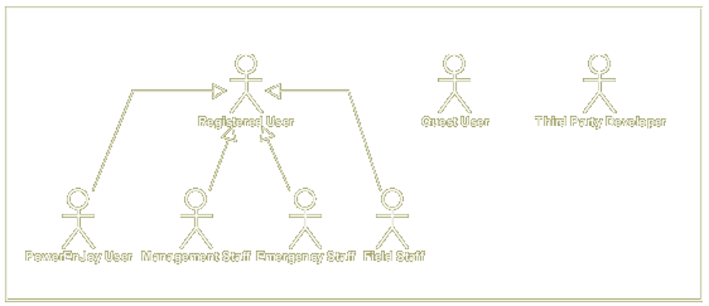

#HSLIDE

#HSLIDE
# PowerEnJoy
  - Erba Alessandro
  - Leveni Filippo
  - Lodi Luca

#HSLIDE
## A new car sharing
#VSLIDE

#VSLIDE
### Electric cars

#VSLIDE
### Incentives eco-friendly behaviors

#VSLIDE
### Higher probability of finding cars

#HSLIDE
# Goals

#VSLIDE
### Business driver related goals
<li> **G.1** user's simple access to the PowerEnjoy services</li><!-- .element: class="fragment" -->
<li> **G.2** higher probability of finding a car, compared to competitors</li> <!-- .element: class="fragment" -->
<li> **G.3** efficient maintenance and recharge process of the cars</li> <!-- .element: class="fragment" -->

#VSLIDE
### Car sharing related goals
<li> **G.4** car reservation, reservation cancellation</li> <!-- .element: class="fragment" -->
<li> **G.5** minimum interaction with payment interfaces </li><!-- .element: class="fragment" -->
<li> **G.6** drive cars, find safe areas where to park </li><!-- .element: class="fragment" -->
<li> **G.7** To encourage users’ virtuous behaviour in relation to service’s fairness. </li><!-- .element: class="fragment" -->

#VSLIDE
### Process efficiency related goals
<li> **G.8** system monitorable / administrable by authorized personal </li><!-- .element: class="fragment" -->
<li> **G.9** authorized personal quickly react to emergencies, user’s safety </li><!-- .element: class="fragment" -->
<li> **G.10** programmable interface, reduce maintainance costs, third party developers. </li><!-- .element: class="fragment" -->

#HSLIDE
# Actors

#VSLIDE

#HSLIDE
### PowerEnJoy user

#VSLIDE
**R.6** find available cars within a certain distance from current location or from address
#VSLIDE
**R.7** reserve a car
#VSLIDE
**R.8** cancel the reservation
#VSLIDE
**R.9** charge for not pick-up within reservation expiry.
#VSLIDE
**R.10** rent a car
#VSLIDE
**R.11** service exclusion for pending payments
#VSLIDE
**R.12** discount 10% for two other passengers
#VSLIDE
**R.13** discount 20% for car left with more than 50% of charge
#VSLIDE
**R.14** discount 30% for plugging-in carto the power plug
#VSLIDE
**R.15** overcharge 30% for car left >3Km from nearest power plug or \<20% charge
#VSLIDE
**R.16** money saving option and discount
#VSLIDE
**R.17** service policies change notification

#HSLIDE
### Field staff users

#VSLIDE
**R.18** notification of relocation/maintenance requests
#VSLIDE
**R.19** car relocation

#VSLIDE
**R.20** special equipment request

#HSLIDE
### Management staff users

#VSLIDE
**R.21** configure safe areas and power plugs
#VSLIDE
**R.22** cofigure cars list
#VSLIDE
**R.23** configure service policies

#VSLIDE
**R.24** manage personnel accounts

#VSLIDE
**R.25** handle unpaid rents

#HSLIDE
### Emergency staff user

#VSLIDE
**R.26** notification of emergencies:
* cars malfunctioning
* car accidents
* cars with empty battery not parked in safe areas

#VSLIDE
**R.27** handle help request

#VSLIDE
**R.28** overview of state and location of:
* cars
* power plugs
* current rents
* reservation
* field staff users

#VSLIDE
**R.29** actions to resolve issues

#HSLIDE
# BPM
### Back-end Process Management

#VSLIDE
# Relocations

#VSLIDE
# Money saving option

#HSLIDE
# UML
#### (RASD)

#VSLIDE
## Class diagram

#VSLIDE?image=presentation/class_diag.pdf.png

#VSLIDE

#VSLIDE

#VSLIDE

#VSLIDE
## Car state chart

#VSLIDE

#HSLIDE
# Hardware

#VSLIDE
## Cars
#VSLIDE

#VSLIDE
### Smart devices
#VSLIDE

#HSLIDE
# Alloy

#VSLIDE

#VSLIDE

#VSLIDE

#HSLIDE
# Resources

#HSLIDE
# Our solution

#VSLIDE
- car distribution algorithm (BPM)
- user finds car nearby <!-- .element: class="fragment" -->
- user satisfaction <!-- .element: class="fragment" -->
#VSLIDE
- car distribution algorithm (BPM)
- automatic relocation request assignment<!-- .element: class="fragment" -->
- maximum staff's efficiency<!-- .element: class="fragment" -->
#VSLIDE
- configurability and extensibility
- minimum maintenance cost<!-- .element: class="fragment" -->

#HSLIDE
# Scenarios

#VSLIDE
## Money Saving Option

#VSLIDE
## Power plug

#VSLIDE
## smart device interface
#VSLIDE

#VSLIDE
## car screen interface
#VSLIDE

#HSLIDE
# Use cases

#VSLIDE

